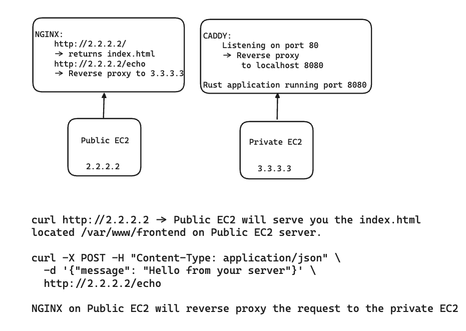

# Tristan Davis - 4640 Assignment 3

## Video: https://www.youtube.com/watch?v=dQw4w9WgXcQ

### Steps to Run the Configuration

#### Pre-requisites

1. Creating SSH key
  - `ssh-keygen -b 4096 -t rsa`
  - File path can be: `~/.ssh/key`
  - This should create a `~/.ssh/key.pem` and `~/.ssh/key.pub` (public and private key)

2. Configuring AWS credentials
  - Follow: https://docs.aws.amazon.com/cli/latest/userguide/cli-chap-configure.html

3. Terraform installed
  - Follow: https://developer.hashicorp.com/terraform/tutorials/aws-get-started/install-cli

4. Ansible installed
  - Follow: https://docs.ansible.com/ansible/latest/installation_guide/index.html
  - This will require you to have Python installed

#### Running Terraform

In the terraform directory, you will find the two terraform directories that we will be executing.

One will be for the backend, which contains the creation of the S3 bucket and DynamoDB table.

The second is the creation of our infrastructure, which will create the EC2 instances and its associated configuration, such as creating one public and one private.

To start, navigate to the backend directory, execute the command `terraform init`, and then `terraform apply` to apply the configuration. The backend needs to be applied before we apply the other infrastructure because that infrastructure relies on the S3 and DynamoDB to be already created.

Once those have been created, you can navigate to the infra directory and execute the command `terraform init`, and then `terraform apply`. This will create all the infrastructure needed for this project, as well as create our inventory file for Ansible.

#### Running Ansible

Before continuing with ansible. You will have to change the reverse proxy in the hello.conf file, to the ip of your private ec2 just created. 

Once the Terraform infrastructure has been successfully deployed, you can move on to Ansible. Ansible will help us configure our two instances, the front-end and back-end.

From within the ansible directory, you will find two roles. Each role has the configuration that will deploy the front-end and back-end to our EC2 instances.

After successfully deploying via Terraform, a file in the inventory directory should have been created. It should have both EC2 instances' IP addresses inside.

In order to run the Ansible configuration, navigate to the ansible directory and run the following:

- `ansible-inventory --graph`: Which shows what the inventory contains
- `ansible-playbook playbook.yml`: To execute the playbook. This will run for both roles
- `ansible-playbook playbook.yml --tags "backend/frontend"`: To execute role-specific.

After you have successfully ran the playbook, what you have created is a front-end Nginx server that you can reach at `http://<ip>`, and it also has a reverse proxy configured that sends requests to the backend IP, which can be reached at `http://<ip>/echo`.

To test, you can run the following:

### Testing your frontend

```bash
curl http://146.190.12.184
```

### Testing your backend

```bash
curl -X POST -H "Content-Type: application/json" \
  -d '{"message": "Hello from your server"}' \
  http://146.190.12.184/echo
```


### Overview to better understand what we created



### Useful commands

- `terraform init`
- `terraform plan`
- `terraform apply`
- `terraform 
